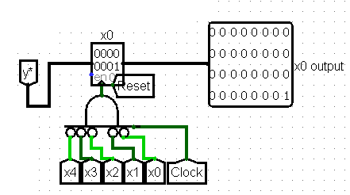

# Progetto Architetture degli Elaboratori

```
Nome e cognome: NOTARI KRISTIAN
Matricola:      892708
Email:          kristian.notari@studenti.unimi.it
````

## Specifiche progetto

### Descrizione generale progetto
Il circuito implementato avrà il compito di rappresentare graficamente su di una matrice led il polinomio (x^2 + x + q), capace di formare rette e parabole, in un intervallo positivo di x (0-31), dati i coefficienti di x^2, x e q in input. La matrice corrisponderà ad un grafico di soli punti interi, dove ogni led corrisponderà ad un numero tra 0 e 31.
Il circuito sarà regolato da un clock che, ad elevata frequenza, permetterà il rapido aggiornarsi della matrice led dati i nuovi valori in input in modo dinamico. Inoltre, avrà la possibilità di salvare un grafico in memoria così da confrontarlo con un altro attivo e modificabile, oltre ad effettuare operazioni di addizione e sottrazione tra i due (di base il circuito, qualora fossero selezionate queste due operazioni, non visualizzerà nulla fino a che almeno un grafico non è stato salvato).

### Interfaccia utente (componenti Input/Output)
L'interfaccia sarà composta da un tastierino numerico da 0 a 9 con cui inserire i coefficienti del polinomio (a singola cifra) e da una matrice led capace di far vedere graficamente l'elemento geometrico desiderato. Inoltre il tastierino avrà una serie di comandi per la gestione degli input (come un tasto annulla e azzera), quelli per la gestione del grafico salvato (salva, elimina, carica) e uno di scelta dell'operazione da effettuare su due eventuali grafici. Vi saranno display per visualizzare i coefficienti attuali e quelli salvati, oltre all'operazione e al coefficiente selezionati.

### Condizioni iniziali del circuito
Il circuito non è dotato di situazioni iniziali o finali pertanto avrà semplicemente i coefficienti del polinomio in input equivalenti a 0 e l'operazione impostata su "doppio grafico".

### Condizioni finali del circuito
Il circuito non è dotato di situazioni iniziali o finali pertanto avrà semplicemente la matrice led in output corrispondente ai dati presenti all'interno del circuito in un dato momento.

### Ciclo tipico di utilizzo descritto in termini di componenti di input/output
L'utente dovrà impostare i coefficienti del polinomio attraverso il tastierino numerico per poi visualizzare l'output sulla matrice di led. Se vorrà, in qualsiasi momento, potrà scegliere quale coefficiente modificare e se resettare il plotter allo stato iniziale o meno, oltre ad effettuare le operazioni sopracitate.

<br><br><br>

## Sottocircuiti implementati

### Gestore input
<br>
Si occupa di gestire l'input utente. Controlla l'inserimento dei coefficienti da tastierino, gestisce gli input di selezione coefficiente e operazione e inoltra al resto del circuito (organizzazione cablaggio) i segnali di controllo dei grafici.<br>
In ingresso ci sono i segnali che determinano il coefficente in uscita, da 0 a 9 compresi, i segnali di reset del circuito, azzera, annulla, inserisci per manipolare i coefficienti, left e right per selezionare il coefficiente da modificare, salva, carica e cancella per manipolare il circuito da salvare, di cui caricare i coefficienti nel grafico attivo o da cancellare, oltre al segnale per modificare l'operazione da effettuare sui due grafici.<br>
In uscita inoltra i segnali di reset, azzera, annulla, inserisci, salva, carica e cancella, che serviranno al resto del circuito e interfaccia il numero inserito, un segnale di click che identifica quando viene premuto un pulsante del tastierino, e il codice operazione selezionato.<br>
Possiede un sottocircuito interno "keypad" che fa corrispondere in modo univoco all'input a 1 di uno dei 10 segnali di ingresso (i numeri da 0 a 9) il numero associato attraverso semplici porte logiche, oltre a registrare in output quando è stato cliccato un pulsante del tastierino. Inoltre possiede due contatori interni a 2 bit con valore minimo 0 (00) e valore massimo 2 (10) che determinano il coefficiente e l'operazione selezionati, modificabili attraverso i segnali di left/right (quando a 1 decrementano/incrementano il contatore, con limite ai valori minimi/massimi) e il segnale di op_code (che incrementa sempre quando a 1, senza limiti inferiori/superiori).

### Memoria dati
<br>
La memoria dati gestisce i dati in input dei coefficienti del grafico attivo interfacciandoli con il resto del circuito e permettendo all'utente operazioni come l'annulla e il salvataggio dei coefficienti del grafico da salvare.<br>
In ingresso ottiene il dato da salvare dal gestore dell'input (che sarebbe il coefficiente scelto), il click dello stesso e il dato di select che dirà quale coefficiente modificare. Inoltre riceverà i segnali di gestione dei dati, ovvero reset, azzera, annulla, inserisci, salva, carica e cancella.<br>
In uscita vi saranno i 3 dati riferiti ai coefficienti attuali e i 3 dati riferiti ai coefficienti del grafico salvato (queste ultime 3 solo per renderli visibili all'utente).<br>
Questo componente contiene 3 componenti principali che gestiscono 3 funzioni separate ma agenti sugli stessi dati: l'inserimento dati da tastierino, la gestione dei coefficienti del grafico salvato e la funzione annulla.

- il primo è la memoria principale, in cui viene salvato temporaneamente il dato in output dal tastierino sfruttando come comando di scrittura il segnale a 1 del click del pulsante. Questo viene poi salvato definitivamente con il comando a 1 dell'input "inserisci" nella posizione indicata dal segnale "select" di selezione. In alternativa questi riceve anche 3 dati riferiti ai 3 coefficienti derivanti o dal grafico salvato o dalla funzionalità annulla, che insieme ad uno specifico codice di selezione scelgono quale dei 3 modificare. Siccome con 2 bit le combinazioni possibili sono 4, le prime 3 servono ad identificare il coefficiente, mentre nell'ultimo caso "11" vengono sovrascritti tutti e 3 i coefficienti, con il comando (segnale a 1) del "save" specifico per annulla e carica.
- il secondo è semplicemente una memoria che prende i 3 coefficienti attuali della memoria principale e li salva quando vi è il segnale di salvataggio del grafico a 1.
- il terzo prende i 3 coefficienti e li salva ogniqualvolta viene fatta un'operazione di modifica su di essi, avendone così l'instanza precedente, insieme al codice che selezionava il coefficiente da modificare. Così una volta premuto il pulsante annulla, viene sovrascritto nella memoria principale solo il coefficiente relativo alla posizione identificata dal codice salvato (tranne 11 come detto in precedenza). I dati in uscita però vengono messi all'interno di 4 multiplexer con i dati usciti dalla memoria del grafico salvato e una costante "11" (per il codice di selezione) e regolati dal segnale di caricamento, così da selezionare i dati da sovrascrivere attraverso un unico ingresso e un unico comando (in OR fra annulla e carica per il salvataggio nella memoria principale).

Ovviamente le funzionalità di reset, azzera, salva e altre, azzerano i contenuti delle varie memorie in accordo alla loro funzione.

### Circuito di calcolo
<br>
Il circuito di calcolo semplicemente usa i dati a disposizione per calcolare le y destinate ad essere disegnate.<br>
In ingresso ottiene dal gestore della memoria i coefficienti attuali, il clock e il reset esternamente.<br>
In uscita produce la y, oltre a informare con quale x è stata calcolata. Vi è poi un segnale di overflow che permetterà di gestire i casi in cui la y avrebbe avuto valori fuori dal range disegnabile (0..31).<br>
Il clock permette di incrementare dinamicamente un contatore interno che varia da 0 a 31 e riparte, che rappresenta le varie x. Per ogni x uscente dal contatore questa viene usata all'interno di un sottocircuito di calcolo che semplicemente restituisce una y e un segnale di overflow (nelle condizioni di cui sopra). Indipendentemente da quando i coefficienti vengono modificati, il circuito elabora date le condizioni attuali. Impostando la frequenza del clock ad un valore elevato non ci si accorge nemmeno dell'aggiornamento dei nuovi valori.

### Circuito di disegno
<br>
Il circuito di disegno fa corrispondere ogni y e x date a delle configurazioni da 32 bit da inserire nella matrice led in input di cui i bit ad 1 corrispondono alla posizione di un led da accendere, così da produrre il risultato visivo, ovvero il grafico voluto. Inoltre gestisce il grafico salvato in memoria già in un formato fornibile in input alla matrice e coordina il circuito di merging dei due grafici, eseguendo l'operazione selezionata.<br>
In ingresso riceve la x e la y attuali, il segnale di un possibile overflow della y (come detto in precedenza), il segnale di clock, i segnali di gestione reset, salva, cancella, oltre al codice dell'operazione da effettuare su i due grafici eventuali.<br>
In uscita inoltra le 32 configurazioni di led accesi/spenti alla matrice led.<br>
E' formato da 3 componenti principali: il circuito che si occupa di trasformare e salvare in configurazioni disegnabili (fornibili alla matrice led) la y derivata dal circuito calcolatore, quello che salva le configurazioni così ottenute in una memoria specifica e quello che riceve entrambe le configurazioni (salvata e attuale) per poterle unire nelle 32 configurazioni finali, a seconda dell'operazione scelta.

- il primo trasforma e salva in configurazioni disegnabili le 32 possibili y in 32 registri (associati alle x da 0 a 31, con il comando di scrittura nei registri che è soggetto, oltre alla x corretta anche al clock, così da modificare il grafico rappresentato solo quando il circuito è in funzione) data la y e la x attuali in numero. Attraverso un decoder decodifica il numero in una configurazione da 32 bit di cui è a 1 il bit corrispondente alla posizione indicata dal numero, che corrisponderà al led da accendere nella matrice e la salva nel registro associato alla x attuale. Qualora si presentasse un overflow, il numero decodificato viene portato con tutti i bit a 0 prima di essere salvato nei registri per indicare la non presenza del grafico in quel punto.
- il secondo è una normale memoria da 32 bit ciascun elemento che al comando di salva memorizza le configurazioni uscenti dal primo circuito che le ha calcolate.
- il terzo ottiene le coppie di configurazioni in base alla x (x0 con x0, e così via) dalla memoria (il secondo circuito) e dal primo, e le unisce in un'unica configurazione a seconda del codice di operazione in input. Elabora 3 diversi schemi di configurazione: doppio grafico, addizione e sottrazione. Nel primo caso mette semplicemente in OR le coppie di configurazione ottendendo così una configurazione a 32 bit in cui 2 sono a 1 (a volte 1 solo, in caso di configurazioni in input uguali). Nel secondo e nel terzo caso decodifica ogni coppia di configurazione nel suo numero originale (la y non codificata) e ne esegue la somma o la sottrazione per poi ricodificare il risultato così da avere uno schema di 32 configurazioni. *Siccome qualora non vi siano bit a 1 in una delle due configurazioni in ingresso della coppia la decodifica in numero non produce un risultato numerico, vi è un segnale di controllo "floating" che porta qualsiasi sia il risultato delle operazioni, la configurazione finale tutta con bit a 0. ~~Inoltre la sottrazione di due zeri porta il componente di logisim della sottrazione a dare un risultato floating, perciò vi è un altro segnale di controllo "zero_zero" che fa si che in output vada una configurazione con un 1 finale, che corrisponde al numero zero.~~ Questo "errore" di logisim è scomparso a progetto completato perciò è ancora presente il suddetto controllo sebbene non necessario, perchè credo testimoni una soluzione ad un problema che potrebbe essere comune/ripetersi.*

## Circuito principale
<br>

| Legenda | Circuiti                  |
| ------: | :------------------------ |
| rosso   | gestore input             |
| verde   | gestore memoria           |
| blu     | circuito di calcolo       |
| giallo  | circuito di disegno       |
| rosa    | circuiti di output visivo |

Il circuito completo è composto da 4 circuiti principali, 2 secondari, 1 clock, un insieme di pulsanti che formano i metodi di input (tastierino e controlli) e 4 output, di cui il primario è la matrice led rappresentante gli elementi desiderati, mentre gli altri 3, il visualizzatore dei coefficienti e i selettori di operazione e coefficiente svolgono ruoli minori.

Il gestore di input riceve tutti i segnali che l'utente può fornire, inoltrandoli al resto del circuito o trasformandoli per renderli in una forma elaborabile.
> I vari pulsanti di input hanno colori differenti per la differente funzione che offrono. Quello rosso di reset del circuito, quelli bianchi per la gestione dell'inserimento di coefficienti, quelli gialli per l'azzeramento degli stessi o l'annullamento dell'ultima operazione, quelli verdi gestiscono il grafico salvato e quello blu l'operazione da eseguire sui due grafici presenti nel circuito. 

Il gestore di input e della memoria si interfacciano inoltre con i circuiti che controllano l'output visivo secondario, visualizzando i dati attuali del circuito.

Il circuito di calcolo e quello di disegno sono gli unici ad usufruire del segnale di clock, in quanto è la parte dinamica del circuito. Il clock è necessario per scorrere tutte le possibili x (0..31) e al rapido aggiornarsi del grafico in output date le modifiche dei coefficienti in input.
> Il clock è come detto in precedenza sfruttato per far si che le nuove configurazioni pronte ad essere immesse nella matrice led siano salvate solo (oltre ad essere selezionato il registro attraverso il corretto numero dato dalla x corrente) quando il segnale del clock è a 1, ovvero il circuito ha un clock attivo. Questo permette sia di avere una situazione iniziale priva della prima y disegnata (a 0 dati i coefficienti nulli) sia che il circuito di disegno può essere "congelato" tramite la disattivazione del clock.

Il circuito di disegno è l'unico ad interfacciarsi con la matrice led, in quanto, ricevuti dal resto del circuito la x e la y e gli altri segnali di controllo, è il solo che ha il compito di trasformare il tutto in configurazioni disegnabili.

In aggiunta ai circuiti principali vi sono due circuiti a puro scopo di semplificazione (quadrettati in rosa), che ricevono i dati da visualizzare all'utente e li mostrano su una mini matrice led (operazione selezionata) e su 3 led di cui 1 acceso (coefficiente selezionato, modificabile dal prossimo inserimento).

## Interazione tra sottocircuiti
I dati in ingresso da utente, seguono un flusso ben preciso. Il gestore dell'input li rende interpretabili dal resto del circuito oltre a prepare tutti gli altri segnali. La memoria poi gioca un ruolo fondamentale perchè è qui che i dati seguono 3 diverse linee di output/input:
- Vengono salvati i valori su cui calcolare la y e portati in uscita per il circuito di calcolo
- Vengono salvati in due gestori di memoria interni i dati attuali per memorizzare i valori precedenti all'ultima modifica effettuata e quelli per il circuito salvato.

Le linee di output quindi sono 3, il circuito di calcolo (che poi renderà disponibili i suoi risultati al circuito di disegno, per finire nella matrice led), la memoria dell'annulla e la memoria del circuito salvato.

Il gestore della memoria si ritrova a gestire tutti i dati input per poterli salvare su comando:
- La memoria dell'annulla deve far riferimento ai dati in input per comprendere l'operazione che è stata effettuata (così come l'annulla stesso)
- La memoria del circuito salvato ottiene i dati su comando. Questa non si interfaccia con gli altri circuiti perchè serve solo a visualizzare i coefficienti salvati a schermo. Questo è possibile perchè di un grafico non vengono salvate le y nè i coefficienti originali bensì le loro configurazioni. Questo sebbene utilizzi più memoria evita di doversi ricordare (e quindi complicare il circuito) di eventuali overflow abbinati a determinate x/y e di ricalcolare ogni volta i valori in contemporanea con il grafico invece attuale, rendendo più complicate le operazioni sincrone con il clock da parte del circuito di calcolo.

Di quest'ultimo punto beneficia poi il circuito di disegno. Infatti le configurazioni del circuito salvato vengono memorizzate in una memoria apposita al suo interno permettendo poi di effettuare delle semplici operazioni di merging, che disporranno solo di semplici porte OR. Nonostante questo, è stato necessario riconvertire in numero la configurazione qualora l'operazione da effettuarsi sia quella di addizione o sottrazione sui due grafici. Il circuito di merging è il seguente:
<br>
L'unità fondamentale riceve le due configurazioni da "unire" e vi applica tre operazioni distinte: la OR (due grafici a schermo), l'addizione e la sottrazione (circuiti appositi). Le 3 uscite corrispondono alle 3 operazioni calcolate, che verrrano poi opportunamente selezionate dal circuito superiore che ne farà vedere una alla volta a seconda dell'op_code. Ci sono però dei casi particolari (come accennato nel circuito di disegno, e qui ben visibile) in cui i circuiti sommatore e differenza si comportano come dovrebbero ma il loro risultato riportato come configurazione risulterebbe erroneo:
- caso configurazioni in input con tutti i bit a 0, che determina un'uscita dai priority encoder (usati per riconveritre la configurazione in numero) indefinita (giustamente) e il segnale "floating" a 1 che verrà poi quindi usato per selezionare il valore corretto da riportare in uscita
- casi configurazioni in input che presentano l'1 finale (una, l'altra, o entrambe) e gli altri bit a 0, che portano uno dei due priority encoder ad avere un'uscita indefinita (come nel caso precedente) oppure ad avere lo zero, che sommato darebbe zero (ma è necessario riportare in output la stessa configurazione in entrata in quanto lo zero viene rappresentato sulla matrice led esattamente con l'ultimo bit a 0) e che sottratto darebbe zero, ma che si vuole con ultimo bit a 1 per il medesimo motivo.
- caso overflow, dove il risultato delle due operazioni di calcolo portava ad un numero non esprimibile attraverso la configurazione in output a 32 bit
- per ultimo vi era quel caso già sopracitato durante la descrizione del circuito di disegno in cui zero - zero veniva interpretato come indefinito dal circuito differenza perciò ne viene fatto un controllo specifico col segnale "zero_zero" visibile nell'immagine
Quindi per gestire la selezione di output sono stati usati il segnale "floating" (le configurazioni nulle, tutti i bit a 0), "zero_zero" (per la sottrazione zero - zero), "a_of" e "s_of" per la gestione degli overflow di calcolo.
> Durante la gestione dei segnali di controllo mi sono imbattuto nel dover inserire in delle porte logiche dei segnali che sarebbero diventati a volte dei segnali indefiniti (vedi segnali di overflow nel caso di configurazioni nulle). Questo ha escluso l'utilizzo di porte AND con i suddetti segnali, mentre ha permesso di sfruttare le porte OR che hanno la proprietà che se almeno uno dei due segnali è a 1, l'altro non viene considerato, non riportando quindi l'errore di segnale indefinito in uscita, che avrebbe compromesso il segnale di selezione dei multiplexer usati per scegliere l'output corretto. Infatti quando il segnale "s_of" risulta indefinito, il floating è posto a 1.

Il circuito di disegno inoltre memorizza data y e x la configurazione corretta, salvando 32 valori diversi, da inserire poi nella matrice led. Ogni registro salva il proprio valore al valore della x corrispondente (il primo registro salva la y attuale solo quando la x è 0, il secondo quando la x è 1 e così via...), attraverso 32 porte AND che gestiscono il segnale di write dei registri (come si può vedere nell'immagine qui sotto). Inoltre per permettere al circuito di avere uno stato iniziale "spento" fino a che non si attivasse il clock (come si può vedere nell'immagine del circuito completo), si è posto questo in AND ogni volta al segnale di cui sopra. In questo modo si evita che i dati iniziali, che per forza di cose sono impostati a 0, producano una retta corrispondente nella matrice led, ma che ciò si verifichi solo dopo aver "acceso" il circuito di calcolo/disegno.
<br><br>

## Considerazioni / possibili estensioni o modifiche

La prima fase di progettazione è stata quella di creare grafici di funzionalità e collegamento tra "parti" che avrebbero effettuato operazioni su carta, per cercare di avere chiaro il quadro della situazione, i passaggi che mi sarebbero servitie e le varie fasi che avrei dovuto considerare.
Lo step successivo è stato definire bene i dati che avrei dovuto ricevere e ciò a cui sarei dovuto arrivare, quindi inizialmente un tastierino per i coefficenti e una rappresentazione grafica dei valori delle y calcolati.
<br>Ho scelto di usare il polinomio x^2 + x + q per la sua semplicità (implementarne diversi tipi sarebbe stato solamente lungo, non avrebbe richiesto maggior sforzo, in quanto sarebbero state ripetizioni di circuiti di calcolo, di cui avrei poi selezionato solo il risultato voluto).
<br>In corso d'opera poi, a progetto concluso e definito, ho aumentato la complessità circuitale inserendo la possibilità di annullare l'ultima operazione effettuata in input sui coefficienti e la possibilità di salvare un grafico in modo da vederne due, addizionarli o sottrarli fra loro.

Il progetto nella sua integrità era partito pensando di calcolare, dati i coefficienti, ogni valore di y sulla base di ogni valore delle x disponibile (da 0 a 31), in una volta sola, senza l'utilizzo di un clock. Questa alternativa è stata scartata per due motivi:
1. Creare un circuito di calcolo che effettuasse 32 operazioni contemporaneamente sarebbe stato semplicemente lungo senza portare alcun beneficio, dovendo poi gestire molteplici possibili segnali di overflow per controllare se e come salvare le y nelle configurazioni da destinare alla matrice, e dato che il clock a frequenza elevata dà praticamente un risultato immediato non sarebbe cambiato nulla.
2. Calcolando i valori ogni volta che il contatore delle x aumenta grazie al clock che si attiva, si può ridurre la frequenza dello stesso per permettere un grafico spezzato, inserendo manualmente i valori al tempo giusto. Questo è possibile anche perchè il grafico viene poi salvato nella sua rappresentazione grafica e non con i valori sempre dipendenti dai coefficienti in input.

In merito al secondo punto c'è da considerare il fatto che i coefficienti del grafico salvati rimangono comunque inesatti, perciò se ricaricati in quelli attuali produrrebbero un risultato diverso.
Un modo alternativo sarebbe potuto esser quello di impostare una x limite per cui ogni valore del contatore raggiunto questo limite non sarebbe stato aggiornato a quello successivo, di modo da preparare i nuovi coefficienti per poi impostare un limite più alto o disattivare il limite per continuare la rappresentazione grafica con i dati aggiornati.

Durante lo sviluppo del progetto mi sono accorto che il coefficiente x^2, se impostato ad un valore diverso da 0, produceva come risultato grafici quasi nulli sulla matrice led dato il rapido aumentare del valore della y, che superava quasi subito il valore massimo rappresentabile (31), ma in corso d'opera ho preferito lasciare le cose semplici. Aumentare i valori rappresentabili avrebbe richiesto una moltitudine di collegamenti aggiuntivi, che non avrebbero cambiato la logica dietro alle operazioni circuitali.

> Nella gestione della memoria, la funzionalità di annulla viene attivata anche dal segnale di caricamento "load" del circuito salvato nei coefficienti attuali. Questo permette di vedere questo pulsante come "load/unload" o come "carica/annulla caricamento".