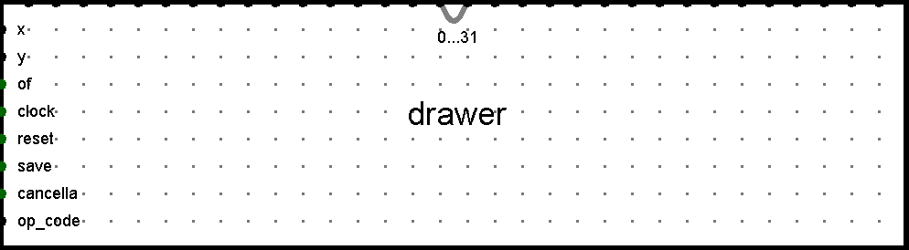

# Progetto Architetture degli Elaboratori

```
Nome e cognome: NOTARI KRISTIAN
Matricola:      892708
Email:          kristian.notari@studenti.unimi.it
````

## Specifiche progetto

### Descrizione generale progetto
Il circuito implementato avrà il compito di rappresentare graficamente su di una matrice led il polinomio (x^2 + x + q), capace di formare rette e parabole, in un intervallo positivo di x (0-31), dati i coefficienti di x^2, x e q in input. La matrice corrisponderà ad un grafico di soli punti interi, dove ogni led corrisponderà ad un numero tra 0 e 31.
Il circuito sarà regolato da un clock che, ad elevata frequenza, permetterà il rapido aggiornarsi della matrice led dati i nuovi valori in input in modo dinamico. Inoltre, avrà la possibilità di salvare un grafico in memoria così da confrontarlo con un altro attivo e modificabile, oltre ad effettuare operazioni di addizione e sottrazione tra i due (di base il circuito, qualora fossero selezionate queste due operazioni, non visualizzerà nulla fino a che almeno un grafico non è stato salvato).

### Interfaccia utente (componenti Input/Output)
L'interfaccia sarà composta da un tastierino numerico da 0 a 9 con cui inserire i coefficienti del polinomio (a singola cifra) e da una matrice led capace di far vedere graficamente l'elemento geometrico desiderato. Inoltre il tastierino avrà una serie di comandi per la gestione degli input (come un tasto annulla e azzera), quelli per la gestione del grafico salvato (salva, elimina, carica) e uno di scelta dell'operazione da effettuare su due eventuali grafici. Vi saranno display per visualizzare i coefficienti attuali e quelli salvati, oltre all'operazione e al coefficiente selezionati.

### Condizioni iniziali del circuito
Il circuito non è dotato di situazioni iniziali o finali pertanto avrà semplicemente i coefficienti del polinomio in input equivalenti a 0 e l'operazione impostata su "doppio grafico".

### Condizioni finali del circuito
Il circuito non è dotato di situazioni iniziali o finali pertanto avrà semplicemente la matrice led in output corrispondente ai dati presenti all'interno del circuito in un dato momento.

### Ciclo tipico di utilizzo descritto in termini di componenti di input/output
L'utente dovrà impostare i coefficienti del polinomio attraverso il tastierino numerico per poi visualizzare l'output sulla matrice di led. Se vorrà, in qualsiasi momento, potrà scegliere quale coefficiente modificare e se resettare il plotter allo stato iniziale o meno, oltre ad effettuare le operazioni sopracitate.

## Sottocircuiti implementati

### Gestore input
<br>
Si occupa di gestire l'input utente. Controlla l'inserimento dei coefficienti da tastierino, gestisce gli input di selezione coefficiente e operazione e inoltra al resto del circuito (organizzazione cablaggio) i segnali di controllo dei grafici.<br>
In ingresso ci sono i segnali che determinano il coefficente in uscita, da 0 a 9 compresi, i segnali di reset del circuito, azzera, annulla, inserisci per manipolare i coefficienti, left e right per selezionare il coefficiente da modificare, salva, carica e cancella per manipolare il circuito da salvare, di cui caricare i coefficienti nel grafico attivo o da cancellare, oltre al segnale per modificare l'operazione da effettuare sui due grafici.<br>
In uscita inoltra i segnali di reset, azzera, annulla, inserisci, salva, carica e cancella, che serviranno al resto del circuito e interfaccia il numero inserito, un segnale di click che identifica quando viene premuto un pulsante del tastierino, e il codice operazione selezionato.<br>
Possiede un sottocircuito interno "keypad" che fa corrispondere in modo univoco all'input a 1 di uno dei 10 segnali di ingresso (i numeri da 0 a 9) il numero associato attraverso semplici porte logiche, oltre a registrare in output quando è stato cliccato un pulsante del tastierino. Inoltre possiede due contatori interni a 2 bit con valore minimo 0 (00) e valore massimo 2 (10) che determinano il coefficiente e l'operazione selezionati, modificabili attraverso i segnali di left/right (quando a 1 decrementano/incrementano il contatore, con limite ai valori minimi/massimi) e il segnale di op_code (che incrementa sempre quando a 1, senza limiti inferiori/superiori).

### Memoria dati
<br>
La memoria dati gestisce i dati in input dei coefficienti del grafico attivo interfacciandoli con il resto del circuito e permettendo all'utente operazioni come l'annulla e il salvataggio dei coefficienti del grafico da salvare.<br>
In ingresso ottiene il dato da salvare dal gestore dell'input (che sarebbe il coefficiente scelto), il click dello stesso e il dato di select che dirà quale coefficiente modificare. Inoltre riceverà i segnali di gestione dei dati, ovvero reset, azzera, annulla, inserisci, salva, carica e cancella.<br>
In uscita vi saranno i 3 dati riferiti ai coefficienti attuali e i 3 dati riferiti ai coefficienti del grafico salvato (questi solo per renderli visibili all'utente).<br>
Questo componente contiene 3 componenti principali che gestiscono 3 funzioni separate ma agenti sugli stessi dati: l'inserimento dati da tastierino, la gestione dei coefficienti del grafico salvato e la funzione annulla.

- il primo è la memoria principale, in cui viene salvato temporaneamente il dato in output dal tastierino sfruttando come comando di scrittura il segnale a 1 del click del pulsante. Questo viene poi salvato definitivamente con il comando a 1 dell'input "inserisci" nella posizione indicata dal segnale "select" di selezione. In alternativa questi riceve anche 3 dati riferiti ai 3 coefficienti derivanti o dal grafico salvato o dalla funzionalità annulla, che insieme ad uno specifico codice di selezione scelgono quale dei 3 modificare. Siccome con 2 bit le combinazioni possibili sono 4, le prime 3 servono ad identificare il coefficiente, mentre nell'ultimo caso "11" vengono sovrascritti tutti e 3 i coefficienti, con il comando (segnale a 1) del "save" specifico per annulla e carica.
- il secondo è semplicemente una memoria che prende i 3 coefficienti attuali della memoria principale e li salva quando vi è il segnale di salvataggio del grafico a 1.
- il terzo prende i 3 coefficienti e li salva ogniqualvolta viene fatta un'operazione di modifica su di essi, avendone così l'instanza precedente, insieme al codice che selezionava il coefficiente da modificare. Così una volta premuto il pulsante annulla, viene sovrascritto nella memoria principale solo il coefficiente relativo alla posizione identificata dal codice salvato (tranne 11 come detto in precedenza). I dati in uscita però vengono messi all'interno di 4 multiplexer con i dati usciti dalla memoria del grafico salvato e una costante "11" (per il codice di selezione) e regolati dal segnale di caricamento, così da selezionare i dati da sovrascrivere attraverso un unico ingresso e un unico comando (in or fra annulla e carica per il salvataggio nella memoria principale).

Ovviamente le funzionalità di reset, azzera, salva e altre, azzerano i contenuti delle varie memorie in accordo alla loro funzione.

### Circuito di calcolo
<br>
Il circuito di calcolo semplicemente usa i dati a disposizione per calcolare le y destinate ad essere disegnate.<br>
In ingresso ottiente dal gestore della memoria i coefficienti attuali, il clock e il reset esternamente.<br>
In uscita produce la y, oltre a informare con quale x è stata calcolata. Vi è poi un segnale di overflow che permetterà di gestire i casi in cui la y avrebbe avuto valori fuori dal range disegnabile (0..31).<br>
Il clock permette di incrementare dinamicamente un contatore interno che varia da 0 a 31 e riparte, che rappresenta le varie x. Per ogni x uscente dal contatore questa viene usata all'interno di un sottocircuito di calcolo che semplicemente restituisce una y e un segnale di overflow (nelle condizioni di cui sopra). Indipendentemente da quando i coefficienti vengono modificati, il circuito elabora date le condizioni attuali. Impostando la frequenza del clock ad un valore elevato non ci si accorge nemmeno del aggiornamento dei nuovi valori.

### Circuito di disegno
<br>
Il circuito di disegno fa corrispondere ogni y e x date a dei valori ad 1 da inserire nella matrice led in input, così da produrre il risultato visivo, ovvero il grafico voluto. Inoltre gestisce il grafico salvato in memoria già in un formato fornibile in input alla matrice e coordina il circuito di merging dei due grafici, eseguendo l'operazione selezionata.<br>
In ingresso riceve la x e la y attuali, il segnale di un possibile overflow della y (come detto in precedenza), i segnali di gestione reset, salva, cancella, oltre all'operazione da effettuare su i due grafici eventuali.<br>
In uscita inoltra le 32 configurazioni di led accesi/spenti alla matrice led.<br>
E' formato da 3 componenti principali: il circuito che si occupa di trasformare e salvare in configurazioni disegnabili (fornibili alla matrice led) la y derivata dal circuito calcolatore, quello che salva le configurazioni così ottenute in una memoria specifica e quello che riceve entrambe le configurazioni (salvata e attuale) per poterle unire nelle 32 configurazioni finali, a seconda dell'operazione scelta.

- il primo trasforma e salva in configurazioni disegnabili le 32 possibili y in 32 registri (associati alle x da 0 a 31) data la y e la x attuali in numero. Attraverso un decoder decodifica il numero in una configurazione da 32 bit di cui è a 1 il bit corrispondente alla posizione indicata dal numero, che corrisponderà al led da accendere nella matrice e la salva nel registro associato alla x attuale. Qualora si presentasse un overflow, il numero decodificato viene portato con tutti i bit a 0 prima di essere salvato nei registri per indicare la non presenza del grafico in quel punto.
- il secondo è una normale memoria da 32 bit ciascun elemento che al comando di salva memorizza le configurazioni uscenti dal primo circuito che le ha calcolate.
- il terzo ottiene le coppie di configurazioni in base alla x (x0 con x0, e così via) dalla memoria (il secondo circuito) e dal primo, e le unisce in un'unica configurazione a seconda del codice di operazione in input. Elabora 3 diversi schemi di configurazione: doppio grafico, addizione e sottrazione. Nel primo caso mette semplicemente in or le coppie di configurazione ottendendo così due grafici risultanti. Nel secondo caso e nel terzo caso codifica ogni coppia di configurazione nel suo numero originale (la y non decodificata) e ne esegue la somma o la sottrazione per poi ridecodificare il risultato così da avere uno schema di 32 configurazioni. *Siccome qualora non vi siano bit a 1 in una delle due configurazioni in ingresso della coppia la codifica in numero non produce un risultato numerico, vi è un segnale di controllo "floating" che porta qualsiasi sia il risultato delle operazioni, la configurazione finale tutta con bit a 0. ~~Inoltre la sottrazione di due zeri porta il componente di logisim della sottrazione a dare un risultato floating, perciò vi è un altro segnale di controllo "zero_zero" che fa si che in output vada una configurazione con un 1 finale, che corrisponde al numero zero.~~ Questo "errore" di logisim è scomparso a progetto completato perciò è ancora presente il suddetto controllo sebbene non necessario, perchè credo testimoni una soluzione ad un problema che potrebbe essere comune/ripetersi.*

## Circuito principale
@@@@@@@@@@@@@@@@@@@@<br>COME FAR ANDARE AVANTI IL CONTATORE DELLE X (CON CLOCK) COSI' E' DINAMICO E SI AGGIORNA SEMPRE CON ALTA FREQUENZA<br>@@@@@@@@@@@@@@@@@@@@
<br>GESTIONE OVERFLOW PERCHE NON POSSO RAPPRESENTARE NUMERI OLTRE 0...31 PER LE Y<br>@@@@@@@@@@@@@@@@@@@@
<br> SICCOME AVREI DOVUTO SALVARE ANCHE L'OVERFLOW DEL NUMERO DA SALVARE, O PREFERITO SALVARLO IN RAPPRESENTAZIONE GRAFICA -> DA CUI TUTTA GESTIONE DEL MERGING<br>@@@@@@@@@@@@@@@@@@@@
<br>SCELTO UN CONTATORE PERCHE OGNI VOLTA CALCOLARE OGNY Y PER OGNI X AVREBBE RICHIESTO UN CIRCUITO LUNGO E COMPLESSO SENZA SENSO QUANDO POSSO AGGIORNARE DINAMICAMENTE<br>@@@@@@@@@@@@@@@@@@@@


## Interazione tra sottocircuiti

## Considerazioni / possibili estensioni o modifiche